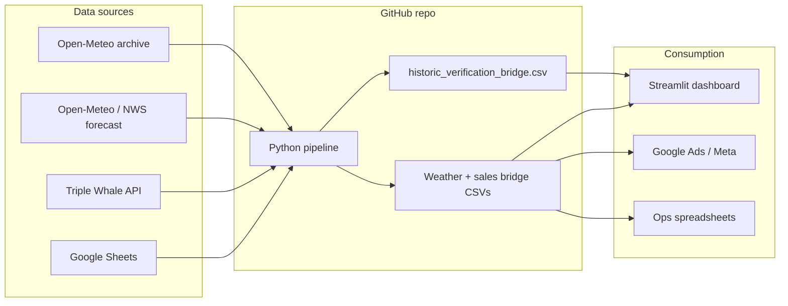
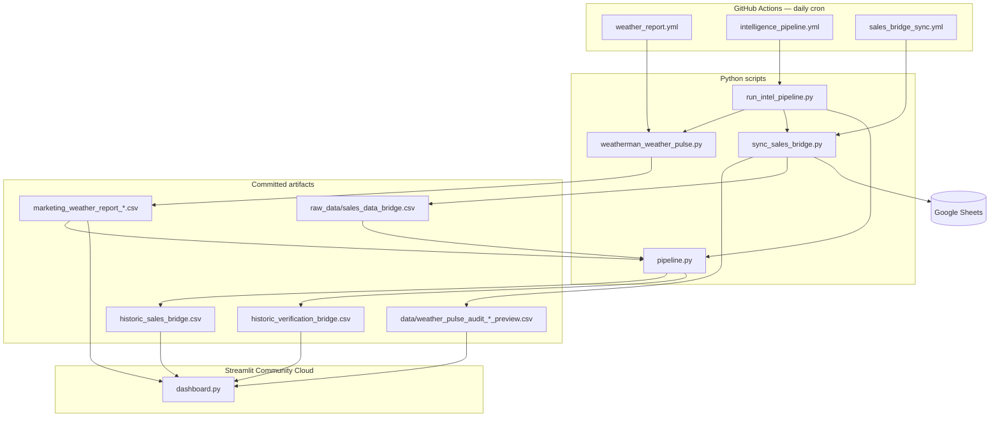
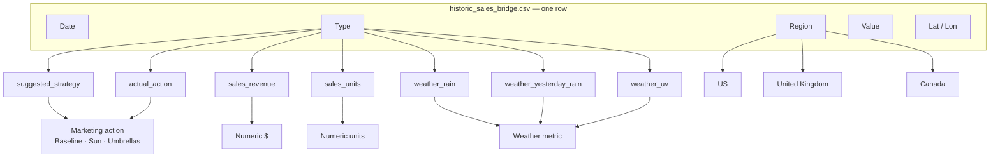
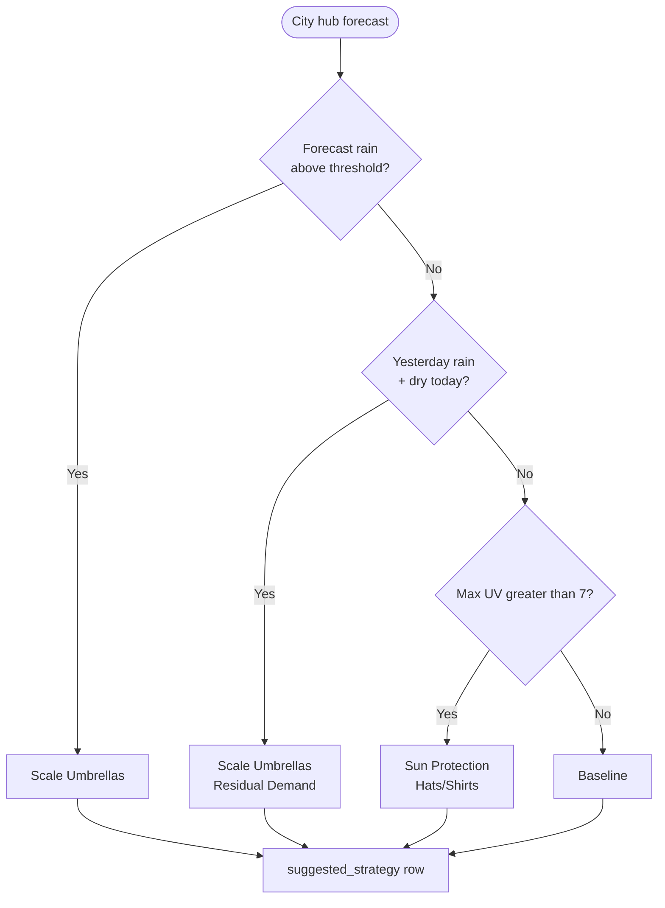
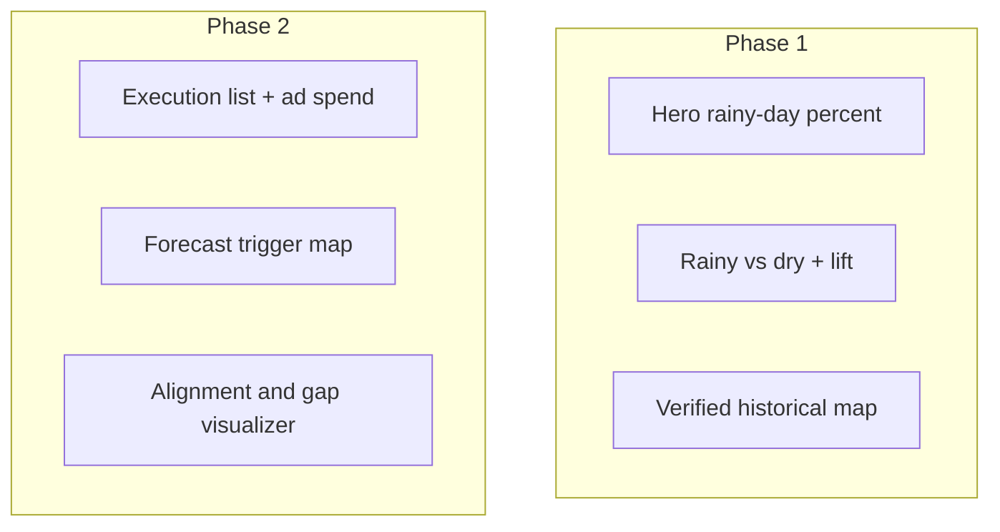
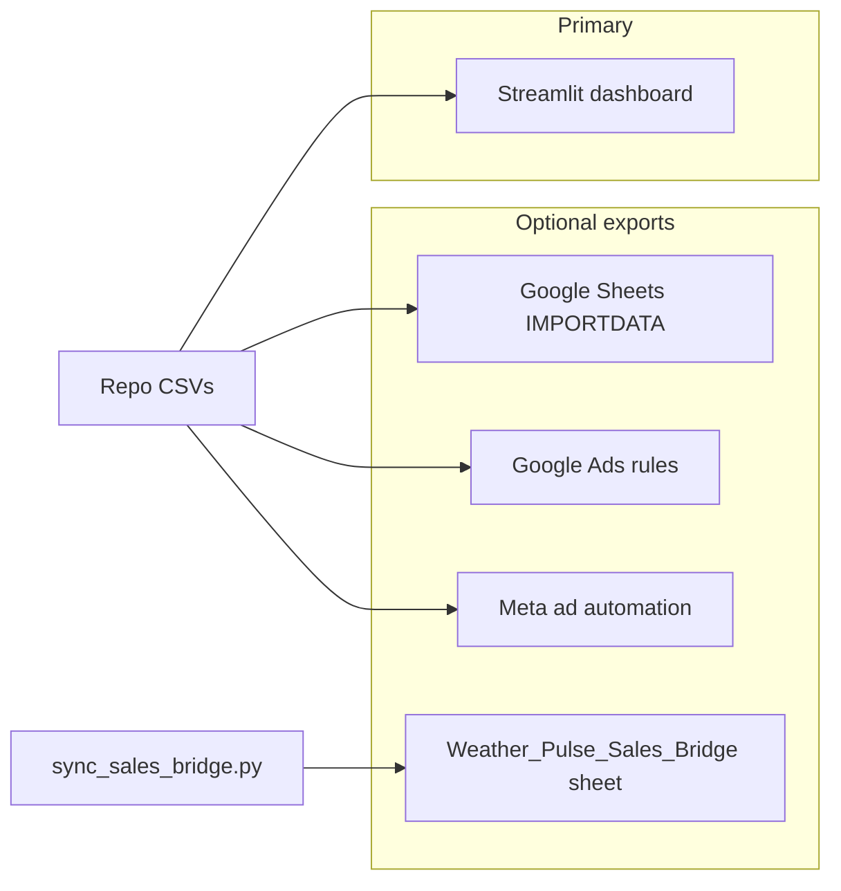

# Weather Pulse · Historical Proof & Strategy

An automated decision-intelligence pipeline for Weatherman. **Phase 1** proves whether umbrella sales happened when it actually rained (same city, same day) using **observed** Open-Meteo archive weather. **Phase 2** (secondary) keeps the forecast-triggered marketing strategy layer (US, UK, Canada) with Triple Whale sales.

---

## Roadmap (how to read this tool)

| Phase | Question | Weather source | Status |
|-------|----------|----------------|--------|
| **1 — Historical proof** | Did umbrella sales happen on rainy days in the same city? | Open-Meteo **archive** (observed precip) | **Primary dashboard** |
| **2 — Forecast & spend** | Where should we scale umbrellas / sun / baseline tomorrow? | NWS / Open-Meteo **forecast** | Secondary (collapsed in UI) |

---

## What you get

| Output | Purpose |
|--------|---------|
| `historic_verification_bridge.csv` | **Phase 1** city-day proof: umbrella $ × observed rain |
| `forecast_ad_spend_bridge.csv` | **Phase 2** 5-day forecast triggers + ad-spend allocation |
| `marketing_weather_report_{us,uk,can}.csv` | Daily weather strategy per city hub (Phase 2 input) |
| `historic_sales_bridge.csv` | Unified long-format dataset for Phase 2 dashboard tabs |
| **Streamlit dashboard** (`dashboard.py`) | Phase 1 hero proof + Phase 2 forecast/alignment (collapsed) |
| `data/umbrella_sku_signals.json` | SKU tags / prefixes that count as umbrella product |
| Google Sheets (optional) | Master SKU bridge + daily regional audit workbooks via `sync_sales_bridge.py` |

**Live dashboard:** deploy `dashboard.py` on [Streamlit Community Cloud](https://share.streamlit.io) (public app). The app reads committed CSVs from this repo—no API keys required on Streamlit itself.



---

## Architecture



### Phase 1 verification bridge

`pipeline.py` builds `historic_verification_bridge.csv` by:

1. Loading transactional sales with real ship-to cities (US / UK / CAN).
2. Tagging **umbrella** rows via `data/umbrella_sku_signals.json`.
3. Fetching **observed** daily precip from the Open-Meteo historical archive (cached under `data/history/observed_precip_cache.csv`).
4. Matching umbrella revenue to rain on the **exact same date + city**.

| Column | Description |
|--------|-------------|
| `Date`, `Region`, `City`, `State`, `Lat`, `Lon` | City-day key |
| `Umbrella_Revenue`, `Umbrella_Units` | Sales tagged as umbrella product |
| `Non_Umbrella_Revenue`, `Non_Umbrella_Units` | Everything else (e.g. sun SKUs) |
| `Observed_Precip_In` | Archive daily precip (inches) |
| `Is_Rainy` | `Observed_Precip_In >= 0.20` |
| `Verified_Match` | Umbrella revenue on a rainy city-day |

**Hero metric:** `% of umbrella revenue on rainy city-days` = rainy umbrella $ ÷ total umbrella $.

Tune umbrella detection in `data/umbrella_sku_signals.json` (`mode`: `exclude_sun` or `include_only`; prefixes / keyword lists).

### Phase 2 forecast & ad-spend bridge

`pipeline.py` also builds `forecast_ad_spend_bridge.csv`:

1. Bulk Open-Meteo **forecast** (daily precip + max UV) for every hub in `city_coordinates.json`.
2. Apply the same trigger rules as Weather Pulse (`rain ≥ 0.20 in` → Scale Umbrellas; `UV ≥ 8` → Sun Protection).
3. Weight each trigger by Phase 1 historical umbrella revenue × forecast intensity.
4. Normalize into a per-day `Spend_Share` (sums to 1.0 across triggered cities).

| Column | Description |
|--------|-------------|
| `Date`, `Region`, `City`, `State`, `Lat`, `Lon` | Forecast hub-day |
| `Forecast_Precip_In`, `Forecast_UV` | Open-Meteo forecast metrics |
| `Action`, `Trigger_Reason` | Imperative marketing action |
| `Hist_Umbrella_Revenue` | Phase 1 city weight |
| `Priority_Score`, `Spend_Share` | Relative ad allocation |

**Bridge schema** (`historic_sales_bridge.csv` — strategy / sales history):

| Column | Description |
|--------|-------------|
| `Date` | Snapshot or order date |
| `Region` | `US`, `UK`, or `CAN` |
| `Type` | Row kind (see below) |
| `Value` | Action label or numeric metric |
| `Lat`, `Lon` | City hub coordinates (weather rows; sales overlay uses audit previews) |

**`Type` values:**

| Type | Meaning |
|------|---------|
| `suggested_strategy` | Weather Pulse marketing action at hub |
| `actual_action` | Executed marketing action (from Triple Whale) |
| `sales_revenue` | Order revenue ($) |
| `sales_units` | Units sold |
| `weather_rain` | Forecast rain (inches) |
| `weather_yesterday_rain` | Prior-day rain |
| `weather_uv` | Max UV index |

**Marketing actions:** `Baseline`, `Sun Protection (Hats/Shirts)`, `Scale Umbrellas`, `Scale Umbrellas (Residual Demand)`.



---

## Intelligence pipeline

One local or CI command runs the full refresh:

```bash
python run_intel_pipeline.py
streamlit run dashboard.py
```

```mermaid
sequenceDiagram
  participant User as Developer / GitHub Actions
  participant Run as run_intel_pipeline.py
  participant WP as weatherman_weather_pulse.py
  participant Sync as sync_sales_bridge.py --dry-run
  participant ETL as pipeline.py
  participant Out as historic_sales_bridge.csv
  participant Ver as historic_verification_bridge.csv

  User->>Run: python run_intel_pipeline.py
  Run->>WP: Fetch US / UK / CAN forecasts
  WP-->>Run: marketing_weather_report_*.csv
  Run->>Sync: Pull Triple Whale + join weather
  Sync-->>Run: data/*_preview.csv + raw_data/sales_data_bridge.csv
  Run->>ETL: Scan raw CSVs + geo lookup + observed rain match
  ETL-->>Out: Unified long-format bridge
  ETL-->>Ver: Phase 1 umbrella × observed rain
  Note over User,Ver: Streamlit Phase 1 reads Ver; Phase 2 reads Out
```

Optional flags: `--skip-weather`, `--skip-sales`, `--serve` (runs Streamlit after pipeline).

---

## Weather logic



Regional CSV endpoints (raw GitHub):

- US: `marketing_weather_report_us.csv`
- UK: `marketing_weather_report_uk.csv`
- CAN: `marketing_weather_report_can.csv`

These remain available for Google Ads, Meta, or Sheets `IMPORTDATA()` if needed—they are no longer the primary analytics surface.

---

## Dashboard

Two primary tabs:

**Phase 1 – Historical Proof**

- Hero: *“XX% of umbrella sales happened on rainy days (same city, same day).”*
- Rainy-vs-dry umbrella revenue + lift
- Verified historical map (green = umbrella sold on an observed rainy day)
- Sidebar CSV export of the filtered verification bridge

**Phase 2 – Forecast & Ad Spend**

- Imperative execution list: *“Scale Umbrellas in [City]”* with dollar allocation from a daily budget
- Forecast trigger map (color = action, size = spend share)
- Alignment & gap visualizer: suggested strategy vs actual execution + autopilot risk
- One-click CSV export of today's ad plan



---

## Repository layout

| Path | Role |
|------|------|
| `weatherman_weather_pulse.py` | Fetches forecasts; writes regional weather CSVs |
| `sync_sales_bridge.py` | Triple Whale + weather join → Google Sheets + preview CSVs |
| `scripts/ci_retry.sh` | Hourly retry wrapper used by GitHub Actions workflows |
| `run_intel_pipeline.py` | One command: weather → sales dry-run → ETL (+ verification) |
| `pipeline.py` | Builds `historic_sales_bridge.csv` + `historic_verification_bridge.csv` + `forecast_ad_spend_bridge.csv` |
| `dashboard.py` | Streamlit UI — Phase 1 proof + Phase 2 forecast / ad spend |
| `historic_verification_bridge.csv` | Phase 1 committed proof dataset |
| `forecast_ad_spend_bridge.csv` | Phase 2 committed forecast + spend allocation |
| `data/umbrella_sku_signals.json` | Umbrella SKU signaling rules |
| `raw_data/` | Staged sales bridge input for ETL |
| `data/city_coordinates.json` | Lat/lon lookup for city-level join / map |
| `data/weather_pulse_audit_*_preview.csv` | City-distributed sales for Phase 2 overlay |
| `.github/workflows/` | Scheduled automation (see below) |

Legacy / auxiliary: `dailysalesreport.py`, `sync_triplewhale_sales.py`, `scripts/generate_city_coordinates.py`.

---

## Local setup

```bash
python -m venv .venv
source .venv/bin/activate   # Windows: .venv\Scripts\activate
pip install -r requirements.txt
cp .env.example .env        # fill in secrets
```

**Required for full pipeline**

| Variable | Used by |
|----------|---------|
| `TRIPLE_WHALE_API_KEY` | Sales sync |
| `GOOGLE_CREDS_FILE` or `GOOGLE_CREDS_JSON` | Google Sheets bridge + audit workbooks |
| `SALES_BRIDGE_SPREADSHEET_ID` | Master sheet ID (`Weather_Pulse_Sales_Bridge`) — local + GitHub secret |
| `AUDIT_BRIDGE_SPREADSHEET_ID_{USA,UK,CAN}` | Daily audit workbook IDs — GitHub secrets for production sync |

Copy `data/orders_by_city.csv` locally (gitignored) for city weight distribution. GitHub Actions uses the committed **`data/city_framework.csv`** and **`data/city_distribution_weights_*.csv`** index instead (regenerate after hub changes):

```bash
python scripts/export_ci_city_index.py
python scripts/generate_city_coordinates.py
```

**Run the full refresh**

```bash
env -u GOOGLE_CREDS_JSON python run_intel_pipeline.py
```

---

## Google Sheets sync (production)

`sales_bridge_sync.yml` runs `sync_sales_bridge.py` daily and pushes **three kinds** of targets:

| Target | Sheet name pattern | GitHub secret | Typical size |
|--------|-------------------|---------------|--------------|
| **Master SKU bridge** | `Weather_Pulse_Sales_Bridge` | `SALES_BRIDGE_SPREADSHEET_ID` | ~300k+ transactional rows (US+UK+CA) |
| **US audit** | `Weather_Pulse_Bridge_USA - MM-DD-YY` | `AUDIT_BRIDGE_SPREADSHEET_ID_USA` | ~8–10k city rows |
| **UK audit** | `Weather_Pulse_Bridge_UK - MM-DD-YY` | `AUDIT_BRIDGE_SPREADSHEET_ID_UK` | ~200 rows |
| **CA audit** | `Weather_Pulse_Bridge_CAN - MM-DD-YY` | `AUDIT_BRIDGE_SPREADSHEET_ID_CAN` | ~300 rows |

The **master** sheet is the combined SKU-level ledger (Date, city/state, platform, SKU, revenue, marketing columns). **Audit** workbooks are the city-hub matrix used with weather for ops / Looker-style daily review.

### Spreadsheet URL from an ID

```text
https://docs.google.com/spreadsheets/d/{SPREADSHEET_ID}/edit
```

GitHub **does not show secret values** after save—copy the ID from the sheet URL in Drive when creating or updating secrets.

### Service account access

Share each target spreadsheet with the **`client_email`** from your service-account JSON (Editor). Example shape:

```text
looker-bridge-sync@….iam.gserviceaccount.com
```

Uncheck “Notify people” when sharing. Your personal Google login and the service account are separate; a sheet can be editable by the bot but show “Page not found” in your browser if you use the wrong URL or account.

### Large master writes (batched)

Sheets above ~8k **data rows** are written in **batches** (default **5,000 rows** per API call) with a short pause between batches. Verification checks the **header row** and **last row** only—not a full readback.

**Google Sheets workbook limit:** 10,000,000 cells. The full SKU ledger is written **locally** to `data/weather_pulse_sales_bridge_master_preview.csv` for dry-runs and Sheets sync — **not committed to git** (files grow past GitHub’s 100 MB hard limit). The **master Google Sheet** gets a **Sheets-only** export: **730-day rolling window** (configurable) and **`Logic_Summary` omitted** (13 columns). If still over budget, oldest rows are trimmed automatically.

Optional tuning (local `.env` or Actions env):

| Variable | Default | Purpose |
|----------|---------|---------|
| `SHEET_WRITE_BATCH_ROWS` | `5000` | Rows per batch write |
| `SHEET_BATCH_WRITE_THRESHOLD` | `8000` | Use batching when data rows exceed this |
| `SHEET_BATCH_PAUSE_S` | `0.5` | Seconds between batches |
| `MASTER_SHEETS_LOOKBACK_DAYS` | `730` | Max age of rows pushed to master sheet |
| `GOOGLE_SHEETS_CELL_BUFFER` | `500000` | Headroom under 10M cell cap |

### Local dry-run (no Sheets)

```bash
python sync_sales_bridge.py --dry-run
```

Writes preview CSVs under `data/weather_pulse_*_preview.csv` without calling Google Sheets.

---

## GitHub Actions

### Secrets (Settings → Secrets → Actions)

| Secret | Purpose |
|--------|---------|
| `TRIPLE_WHALE_API_KEY` | Live sales (Triple Whale SQL) |
| `GOOGLE_CREDS_JSON` | Full service-account JSON for Sheets |
| `SALES_BRIDGE_SPREADSHEET_ID` | Master `Weather_Pulse_Sales_Bridge` |
| `AUDIT_BRIDGE_SPREADSHEET_ID_USA` | US daily audit workbook |
| `AUDIT_BRIDGE_SPREADSHEET_ID_UK` | UK daily audit workbook |
| `AUDIT_BRIDGE_SPREADSHEET_ID_CAN` | CA daily audit workbook |

### Variables (Settings → Variables → Actions)

Used by **scheduled** runs for workflow-level retry (see below):

| Variable | Default | Purpose |
|----------|---------|---------|
| `CI_RETRY_MAX_ATTEMPTS` | `5` | Max tries per job (first run + retries) |
| `CI_RETRY_WAIT_SECONDS` | `3600` | Wait between failed attempts (1 hour) |

Manual **Run workflow** can override attempts and wait minutes via workflow inputs instead.

### Workflows

| Workflow | Schedule | What it does | Job timeout |
|----------|----------|--------------|-------------|
| `weather_report.yml` | Daily ~10:00 UTC | Weather Pulse CSVs → commit `marketing_weather_report_*.csv` | 6 h |
| `intelligence_pipeline.yml` | Daily ~10:30 UTC | Sales dry-run + ETL → commit bridge & previews (not weather CSVs) | 6 h |
| `sales_bridge_sync.yml` | Daily ~11:00 UTC | Production Google Sheets sync (master + audit) | 6 h |

Each workflow wraps its main Python step in `scripts/ci_retry.sh`: on failure it waits (default **1 hour**) and reruns the **entire** script until success or max attempts. Short **in-script** retries (seconds) still apply for transient Google API errors during batched writes.

```mermaid
gantt
  title Daily automation (UTC)
  dateFormat HH:mm
  axisFormat %H:%M

  section Weather
  weather_report.yml           :a1, 10:00, 30m

  section Intelligence
  intelligence_pipeline.yml  :a2, 10:30, 45m

  section Sheets
  sales_bridge_sync.yml        :a3, 11:00, 90m
```



**Committed by automation**

- `weather_report.yml`: `marketing_weather_report_{us,uk,can}.csv`, `data/history/weather/`
- `intelligence_pipeline.yml`: lean artifacts only — `historic_sales_bridge.csv`, `historic_verification_bridge.csv`, `forecast_ad_spend_bridge.csv`, audit previews, city overlay / weights. **Not** full SKU previews (`*_master_preview`, `*_us_preview`, `sales_ledger`, `raw_data/sales_data_bridge`) — those break GH’s 100 MB limit and live in Sheets / CI workspace only.
- `sales_bridge_sync.yml`: no repo commits (Sheets only); optional `history_archive.py` ledger bootstrap on success

Streamlit redeploys when committed CSVs on `main` change.

---

## Deploy dashboard (Streamlit Cloud)


1. Push this repo to GitHub (public repo recommended for a second free app).
2. [share.streamlit.io](https://share.streamlit.io) → **Create app**.
3. Repository: `mg22mex/marketing-weather-engine`, branch `main`, main file: **`dashboard.py`**.
4. Choose **Public** if you already use your one private app slot elsewhere.

Ensure `dashboard.py`, `requirements.txt`, `runtime.txt`, `historic_verification_bridge.csv`, and `historic_sales_bridge.csv` are on `main`. Run the **Intelligence Pipeline** workflow once so audit previews exist for the Phase 2 sales overlay.

---

## Marketing integrations

**Primary:** Phase 1 Streamlit proof (hero %, rainy-vs-dry, verified map, CSV export).

**Secondary:** Phase 2 forecast strategy / alignment (collapsed in the dashboard).



- Link regional weather CSVs into Google Sheets via `=IMPORTDATA()` or scheduled imports.
- Use `Marketing_Action` in Google Ads / Meta rules to bias ad sets toward umbrella or sun campaigns on trigger days.
- **Master bridge** (`Weather_Pulse_Sales_Bridge`): SKU-level ledger synced by `sales_bridge_sync.yml` (~300k+ rows; batched writes).
- **Regional audit** sheets (`Weather_Pulse_Bridge_{USA,UK,CAN} - MM-DD-YY`): daily city matrix + weather actions for ops review.

---

## Security

This is a lean production repo. **Never commit** `.env`, service-account JSON, `data/orders_by_city.csv`, or full SKU sales ledgers (GitHub hard-rejects blobs over 100 MB). Use GitHub Actions secrets for CI. Local runs: prefer `GOOGLE_CREDS_FILE` over inline `GOOGLE_CREDS_JSON` if your shell truncates long JSON.

---

## Tech stack

- Python 3.11 (`runtime.txt`)
- pandas, Streamlit, Altair
- aiohttp / requests (weather APIs)
- gspread + google-auth (Sheets)
- GitHub Actions (cron)
- Streamlit Community Cloud (dashboard hosting)
